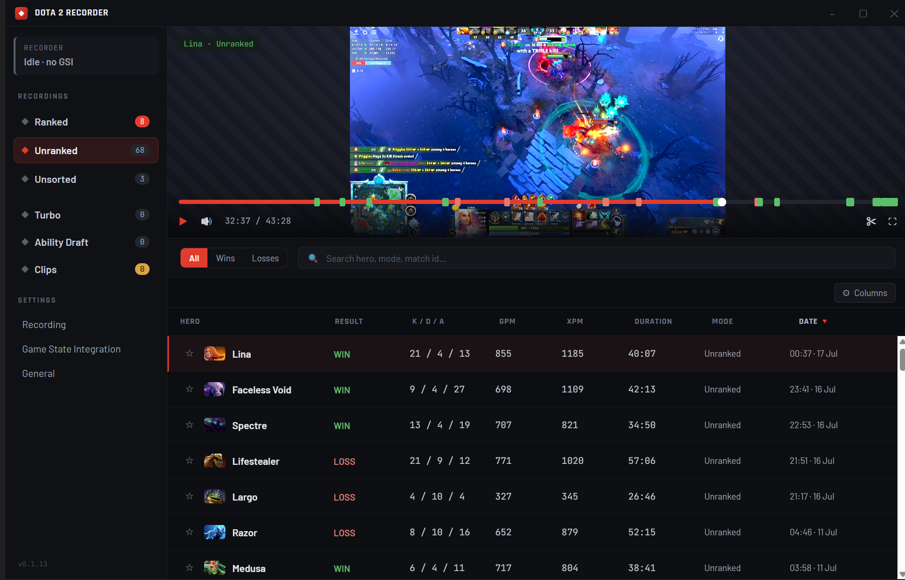
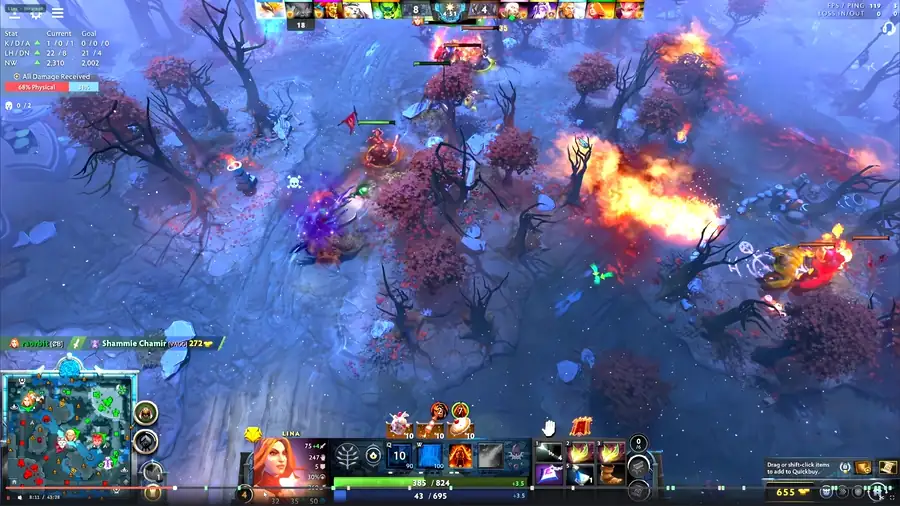

# dota-recorder

[](https://github.com/raorbit/dota-recorder/releases)

A local-only Windows desktop app that auto-records every Dota 2 match, tags your own
deaths and kills on a timeline, and lets you click a marker to jump straight to that
moment in the recorded video. It bundles and auto-configures its own OBS instance, so
there's no manual OBS setup — point it at your Dota install once and it records in the
background.



Click a marker and the VOD jumps to just before that moment, so you watch the play unfold:



Modeled on [Warcraft Recorder](https://github.com/aza547/wow-recorder), adapted to Dota's
data reality: there's no on-disk combat log, so live
[Game State Integration](https://developer.valvesoftware.com/wiki/Counter-Strike:_Global_Offensive_Game_State_Integration)
(GSI) — a local HTTP feed the game itself pushes once you add Valve's
`-gamestateintegration` launch option — is what drives both recording and tagging. Nothing
reads game memory and nothing injects into the game process; the app only listens to what
Dota broadcasts, so there's no VAC/anti-cheat surface.

## How it works

```
Renderer (React / Vite)
   │  REST + WebSocket over 127.0.0.1
Electron main  ── supervises ──►  JVM core (Spring Boot)
   │  spawns + reaps                 │
   └──────────────► OBS  ◄───────────┘   (bundled, auto-configured, obs-websocket)
   Dota 2 ── GSI HTTP POST ──►  core
```

Electron is the sole supervisor: it spawns and reaps both the JVM core and OBS, and the
renderer talks to the core over loopback only. Nothing binds beyond `127.0.0.1`, and
there's no server or account — your matches never leave your machine. The core parses GSI
frames into match state, drives an OBS recording, diffs your kills and deaths into
timeline markers, and stores VODs plus markers in SQLite.

The one design detail worth calling out: seek offsets are computed on a monotonic clock
anchored at OBS's record-start confirmation, never Dota's `game_clock` (which pauses and
rewinds). That's what makes clicking a marker land on the right frame instead of drifting.

See [ARCHITECTURE.md](ARCHITECTURE.md) for the full design — process lifecycle, clock
domains, crash recovery, storage, and the security model — and
[DEVELOPMENT.md](DEVELOPMENT.md) for how the project was built and validated.

## Features

- **Automatic recording** — detects match start from GSI and records in the background;
  there's a stop button in the status card if you want to cut a recording short.
- **Death/kill markers** — diffs your own kills and deaths into timeline markers, so a
  click seeks the video to the right frame.
- **Browse & review** — filter your match library, multi-select with shift/ctrl-click for
  bulk actions (star, delete), and seek ±10s with the arrow keys in the player.
- **Audio mixer** — a single mixer with game, mic, and desktop sources; mic and desktop
  default off so Discord and system audio don't leak into VODs.
- **OpenDota enrichment** — fills in match metadata from OpenDota after each game.
- **Retention** — a disk-cap sweeper reclaims space by deleting old VODs while keeping
  each match's metadata and markers.
- **Demo matches** — Hero Demo sessions are skipped by default (real matches only); a
  *Record demo matches* setting captures them too.

## Network activity

No server, no account, no telemetry — your recordings, markers, match database, and Dota account id
all stay on your machine. The app does make a small, fully enumerable set of outbound calls, listed
here in full. The only thing ever sent to a third party is public Dota **match IDs**.

**On your machine only (loopback).** How the app's own processes talk to each other — all bound to
`127.0.0.1`, which is also why installing doesn't trip a Windows firewall prompt:

| Channel | Address | Purpose |
| --- | --- | --- |
| Dota 2 → core | `127.0.0.1:3223` | Game State Integration (token-authenticated) |
| renderer ↔ core | `127.0.0.1:3224` | UI ↔ core REST + status WebSocket (per-launch bearer token) |
| core ↔ OBS | `127.0.0.1:4466` | obs-websocket, to drive the bundled OBS |

**External, at runtime:**

| Host | When | What's sent | Control |
| --- | --- | --- | --- |
| `api.opendota.com` | After each match is recorded | The public **match ID** — plus your optional OpenDota API key only if you set one. Fetches the official scoreboard for result/stats. Your Dota **account id stays local** (used to find your row in the scoreboard) and is never sent. | Automatic; leave the API-key field blank for anonymous requests |
| `cdn.cloudflare.steamstatic.com` | **Fallback only** — a hero portrait not in the bundled set (e.g. a hero newer than your build) | One `<hero>.png` image request (your IP + which hero). Portraits ship bundled, so normal use requests nothing here. | Only reached for a not-yet-bundled hero |
| `github.com` | **Packaged builds only** — update checks (~2 min after launch, then every 4 h) and any update download you choose to install; also opening release notes | Your IP + the current app version | Settings → **Auto-update** (on by default) |

**External, at build time only** — on the build machine; the shipped app never calls these:
`npm run fetch:obs` pulls OBS from GitHub, `npm run fetch:ffmpeg` pulls ffmpeg from `gyan.dev`, and
`npm run fetch:hero-icons` pulls the hero list from OpenDota plus every portrait from the Steam CDN
(bundled so icons render offline).

A Content-Security-Policy further restricts the renderer to the loopback core and to images from the
app itself plus the Steam CDN, so even a bug can't exfiltrate to an arbitrary host.

## Install

1. Download the latest `Dota-2-Recorder-Setup-*.exe` from the
   [Releases](https://github.com/raorbit/dota-recorder/releases) page and run it. The
   installer bundles everything it needs — OBS, ffmpeg, and a trimmed JRE — so there's
   no separate setup.

   > **Windows will warn you** ("Windows protected your PC / Unknown publisher"): the
   > installer isn't code-signed, because signing certificates cost real money for a free
   > hobby project. Click **More info → Run anyway**. If you'd rather not run an unsigned
   > binary, the app is fully open source — audit the
   > [network activity](#network-activity) above, or build the installer yourself.

2. Launch the app, open **Settings → Game State Integration**, and click **Set up
   automatically** — it finds your Dota install through Steam and writes the GSI config
   file for you.
3. Add `-gamestateintegration` to Dota's Steam launch options (the same panel shows you
   the exact string to copy) and restart Dota.

That's it. Start a match and it records. VODs land in `Videos\Dota2Rec` at roughly 2 GB
per match on the default Stream/30 fps quality, and a 50 GB disk cap reclaims space from
the oldest unstarred VODs first — a swept match keeps its metadata and markers. Folder,
quality, and cap are all adjustable in Settings.

### Requirements

- Windows 10/11
- Dota 2 with `-gamestateintegration` in its Steam launch options
- A GPU/CPU that can record (the app probes for a hardware encoder, falling back to x264)

> **Streaming with your own OBS?** This app runs its own background OBS instance that
> Game-Captures Dota. Ports and config never clash with your install (the managed OBS
> lives in its own profile on a private websocket port), but two Game Capture hooks on
> one game can conflict — if your stream's Dota capture flickers or goes black while the
> app records, switch your streaming OBS to Display Capture for Dota.

## Building from source

Two build pipelines converge in electron-builder: **Gradle** for the JVM core and
**npm/Vite** for the Electron renderer + main.

```sh
# one-time: download the pinned portable OBS used in dev (~hundreds of MB)
npm run fetch:obs
# optional in dev — hero icons otherwise fall back to the Steam CDN at runtime
npm run fetch:hero-icons

# dev (hot UI + Electron; build the core jar first)
cd core && ./gradlew bootJar && cd ..
npm run dev

# typecheck (renderer + electron main)
npm run typecheck

# core unit tests
cd core && ./gradlew test

# full Windows installer (NSIS): fetches OBS + ffmpeg + hero icons, then builds
# core jar + trimmed JRE + renderer + electron
npm run dist
```

## Bundled software

The installer redistributes two unmodified open-source tools, each running as its own
process:

- [OBS Studio](https://github.com/obsproject/obs-studio) (GPLv2) does the capture; its
  license text ships with the app under `obs/obs-portable/data/obs-studio/license/`.
- [ffmpeg](https://ffmpeg.org) (GPL — the [gyan.dev](https://www.gyan.dev/ffmpeg/builds/)
  essentials build, sources at
  [GyanD/codexffmpeg](https://github.com/GyanD/codexffmpeg)) cuts clips; its license
  ships next to the binary at `ffmpeg/LICENSE`.

## License

The app's own code is [MIT](LICENSE). The bundled OBS and ffmpeg keep their own licenses,
listed above.
